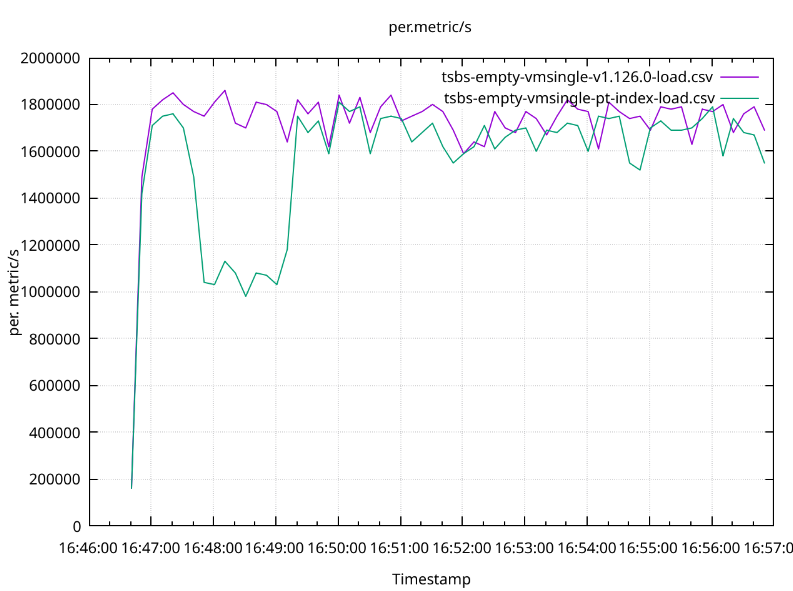

# Partition Index Performace Testing

All benchmarks will be comparing `OSS vmsingle v1.126.0` and
`OSS vmsingle w/ pt-index` (which is basically the current master + pt-index
changes).

All benchmarks are run on
[e2-standard-8](https://cloud.google.com/compute/docs/general-purpose-machines#e2_machine_types)
GCP instance because:

- Running on a benchmark personal laptop is not reliable because it typically
  has bunch of other stuff running and it will be hard for others to reproduce.
- This is the default type of node in GCP GKE and therefore will be chosen more
  often.
- Previous benchmark runs show that VictoriaMetrics performance is the worst on
  this type of instance. Other instance types typically show much better
  results, such as
  [n2-standard-8](https://cloud.google.com/compute/docs/general-purpose-machines#n2_series)
  and
  [n2d-standard8](https://cloud.google.com/compute/docs/general-purpose-machines#n2d_machines).
  And it is important to show the worst case scenario.
  - The `worst performance` here means that whenever we add a feature that may
    affect the performace of the storage, the performance of the new version
	compared to the old version is the worst on `e2`, while benchmarks run on
	`n2` or `n2d` show often acceptable or even excellent results. I.e. we are
	not comparing the performance of a given version on `e2` and `n2` which will
	obviously be different.

# TSBS: Empty

Run [TSBS](https://github.com/timescale/tsbs) against an empty database without
and with pt index.

## Data

- Time range: the whole previous day
- There are 100K instances. Each instance emits 10 unique metrics (TSBS
  [cpu-only](https://github.com/timescale/tsbs?tab=readme-ov-file#dev-ops) use
  case). Therefore, 100K instances emit 1M unique metrics.
- Samples are emitted every 80s and there are 3600*24 / 80 = ~1K
  80s intervals within 24 hours
- And total number of samples: 1M metrics × ~1K intervals = ~1B

- 4 concurrent workers ingest those 1B samples
- querying happens after the ingestion is completed
- 4 concurrent workers send 1k queries of a given type.
- There are 10 [query types](https://github.com/timescale/tsbs?tab=readme-ov-file#devops--cpu-only):

  - `single-groupby-1-1-1`
  - `single-groupby-1-1-12`
  - `single-groupby-1-8-1`
  - `single-groupby-5-1-1`
  - `single-groupby-5-1-12`
  - `single-groupby-5-8-1`
  - `cpu-max-all-1`
  - `cpu-max-all-8`
  - `double-groupby-1`

  The following query types are omitted due to being to heavy:
  `double-groupby-5`, `double-groupby-all`.

## Results

Load summary:

- v1.126.0: loaded 1080000000 samples in 629.088sec with 4 workers (mean rate 1716771.07 samples/sec)
- pt-index: loaded 1080000000 samples in 687.479sec with 4 workers (mean rate 1570957.15 samples/sec)

I.e. pt-index was 9% slower.

Below is the graph of the samlpe load rate over time:



Comparison of some important metrics

Metric                             | v1.126.0    | pt-index    | diff %
---------------------------------- | ----------- | ----------- | ------
process_cpu_seconds_system_total   | 217.93      | 271.81      | +25
process_cpu_seconds_total          | 3901.61     | 4197.49     |  +8
process_cpu_seconds_user_total     | 3683.68     | 3925.68     |  +7
process_resident_memory_bytes      | 1440911360  | 1246068736  | -12
process_resident_memory_peak_bytes | 2825252864  | 2843361280  |  +1
process_io_read_bytes_total        | 42190959504 | 42581097874 |  +1
process_io_written_bytes_total     | 5635185803  | 5920760702  |  +5

Query summary:

Query Type            | v1.126.0 | pt-index
--------------------- | -------- | --------
single-groupby-1-1-1  | 
single-groupby-1-1-12 |
single-groupby-1-8-1  |
single-groupby-5-1-1  |
single-groupby-5-1-12 |
single-groupby-5-8-1  |
cpu-max-all-1         |
cpu-max-all-8         |
double-groupby-1      |


## How to run

Start `OSS vmsingle v1.126.0`:

```shell
git checkout v1.126.0
make clean victoria-metrics
./bin/victoria-metrics -storageDataPath=../data
```

In a separate terminal and git client, run TSBS:

```shell
make tsbs | tee ~/tsbs-empty-vmsingle-v1.126.0.log
```

Stop vmsingle.

In a separate terminal, start `OSS vmsingle w/ pt-index`:

```shell
git switch issue-7599
make clean victoria-metrics
./bin/victoria-metrics -storageDataPath=../data
```

In TSBS terminal, run TSBS:

```shell
make tsbs | tee ~/tsbs-empty-vmsingle-pt-index.log
```

Copy load results into a csv file:

```
~/tsbs-empty-vmsingle-v1.126.0.log -> ~/tsbs-empty-vmsingle-pt-v1.126.0.csv
~/tsbs-empty-vmsingle-pt-index.log -> ~/tsbs-empty-vmsingle-pt-index-load.csv
```

In TSBS terminal, plot load graph:

```shell
make tsbs-plot-load \
  TSBS_LOAD_RESULT_CSV_FILE=~/tsbs-empty-vmsingle-v1.126.0-load.csv \
  TSBS_LOAD_RESULT_CSV_FILE_COMPARE=~/tsbs-empty-vmsingle-pt-index-load.csv
```
