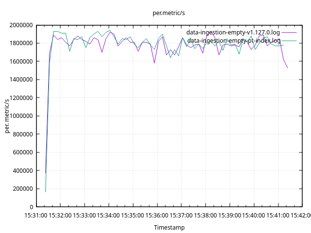
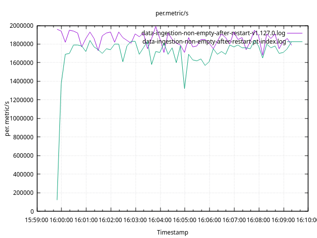

# Partition Index Performace Testing

## Preconditions

### Types of Benchmarks

We will perform three types of benchmarks:

1. [Data Ingestion](#data-ingestion): these benchmarks examine the performance
   of data ingestion in context of the use cases that we believe will be
   applicable to most of the users.
2. [Index Queries](#index-queries): these benchmarks examine the performace of
   the retrieval of various index data, such as metric names, label names, and
   label values. Basic data retrieval is also covered by these benchmarks.
   Again, we will cover the most common use cases only.
3. [Data Queries](#data-queries): examines the performance of some selected
   Prom/MetricsQL queries. It is unlikely that these queries are the most used
   ones, but they are designed to examine different constructs of the query
   language to see how they affect performance of data retrieval.

### Versions under Test

All benchmarks will be comparing `OSS vmsingle v1.127.0` and
`OSS vmsingle w/ pt-index` (which is basically the current `master` + `pt-index`
changes).

### Testing Environment

All benchmarks are run on
[e2-standard-8](https://cloud.google.com/compute/docs/general-purpose-machines#e2_machine_types)
GCP instance because:

- Running on a benchmark personal laptop is not reliable because it typically
  has bunch of other stuff running and it will be hard for others to reproduce.
- This is the default type of node in GCP GKE and therefore will be chosen more
  often.
- Previous benchmark runs show that VictoriaMetrics performance is the worst on
  this type of instance. Other instance types typically show much better
  results, such as
  [n2-standard-8](https://cloud.google.com/compute/docs/general-purpose-machines#n2_series)
  and
  [n2d-standard8](https://cloud.google.com/compute/docs/general-purpose-machines#n2d_machines).
  And it is important to show the worst case scenario.
  - The `worst performance` here means that whenever we add a feature that may
    affect the performace of the storage, the performance of the new version
	compared to the old version is the worst on `e2`, while benchmarks run on
	`n2` or `n2d` show often acceptable or even excellent results. I.e. we are
	not comparing the performance of a given version on `e2` and `n2` which will
	obviously be different.

## Data Ingestion

To test data ingestion we will be using [TSBS](https://github.com/timescale/tsbs).

We will consider the following use cases:

1. [Empty](#empty): Load the data into an empty database. This benchmark
   compares the performance of new `pt-index` deployments with `v1.127.0`
   deployments that haven't been upgraded to `pt-index` yet. This benchmark
   should answer the question whether the `pt-index` is better or worse than
   previous versions in context of data ingestion.
2. [Non-empty with Restart](#non-empty-with-restart): Load the data into a
   non-empty database after the database restart. This benchmark symulates the
   upgrade of existing deployments from `v1.127.0` to `pt-index`. It should
   answer the question if there will be any performance degradation shortly
   after upgrading the deployment to `pt-index`.

For each use case we will use the same data:

- The time range is the whole previous day
- There are 100K instances. Each instance emits 10 unique metrics (TSBS
  [cpu-only](https://github.com/timescale/tsbs?tab=readme-ov-file#dev-ops) use
  case). Therefore, 100K instances emit 1M unique metrics.
- Samples are emitted every 80s and there are 3600*24 / 80 = ~1K
  80s intervals within 24 hours
- And total number of samples: 1M metrics × ~1K intervals = ~1B

The data is generated only once before all tests:

```shell
make tsbs-build tsbs-generate-data
```

During each test, 4 concurrent workers ingest the data.

Below are the benchmark results and the description how each benchmark for done.

### Empty

Overall the `pt-index` performance is very close to `v1.127.0`.

Load summary:

- `v1.127.0`: loaded 1080000000 metrics in 754.187sec with 4 workers (mean rate 1432005.31 metrics/sec)
- `pt-index`: loaded 1080000000 metrics in 762.711sec with 4 workers (mean rate 1416002.27 metrics/sec)

I.e. pt-index is `~1%` slower.

Below is the graph of the sample load rate over time:



Comparison of some important metrics

Metric                             | v1.127.0    | pt-index    | diff %
---------------------------------- | ----------- | ----------- | ------
process_cpu_seconds_system_total   | 305.48      | 299.73      | 1.88
process_cpu_seconds_total          | 5381.76     | 5427.92     | -0.85
process_cpu_seconds_user_total     | 5076.28     | 5128.19     | -1.02
process_resident_memory_bytes      | 1531187200  | 1343549440  | 12.25
process_resident_memory_peak_bytes | 3479142400  | 3265609728  | 6.13
process_io_read_bytes_total        | 43229424002 | 43078044931 | 0.35
process_io_written_bytes_total     | 6648707564  | 6592771686  | 0.84

Raw load logs:

- [v1.127.0](../perf/data-ingestion-empty-v1.127.0.log)
- [pt-index](../perf/data-ingestion-empty-pt-index.log)

#### How to Run

In terminal #2, start `v1.127.0`:

```shell
git checkout v1.127.0
make clean victoria-metrics
rm -Rf ../data/*
./bin/victoria-metrics -storageDataPath=../data
```

In terminal #1, run TSBS data load:

```shell
make tsbs-load-data | tee data-ingestion-empty-v1.127.0.log
```

Stop `v1.127.0`.

In terminal #3, start `pt-index`:

```shell
git switch issue-7599
make clean victoria-metrics
rm -Rf ../data/*
./bin/victoria-metrics -storageDataPath=../data
```

In terminal #1, run TSBS data load:

```shell
make tsbs-load-data | tee data-ingestion-empty-pt-index.log
```

Stop `pt-index`.

In terminal #1, plot load graph:

```shell
make tsbs-plot-load \
  TSBS_LOAD_RESULT_CSV_FILE=data-ingestion-empty-v1.127.0.log \
  TSBS_LOAD_RESULT_CSV_FILE_COMPARE=data-ingestion-empty-pt-index.log
```

</details>

### Non-Empty with Restart

Overall the `pt-index` performance is very close to `v1.127.0`.

Load summary:

- `v1.127.0`: TBD
- `pt-index`: TBD

I.e. pt-index is ~1% slower.

Below is the graph of the sample load rate over time:



Comparison of some important metrics

Metric                             | v1.127.0    | pt-index    | diff %
---------------------------------- | ----------- | ----------- | ------
process_cpu_seconds_system_total   | 305.48      | 299.73      | 1.88
process_cpu_seconds_total          | 5381.76     | 5427.92     | -0.85
process_cpu_seconds_user_total     | 5076.28     | 5128.19     | -1.02
process_resident_memory_bytes      | 1531187200  | 1343549440  | 12.25
process_resident_memory_peak_bytes | 3479142400  | 3265609728  | 6.13
process_io_read_bytes_total        | 43229424002 | 43078044931 | 0.35
process_io_written_bytes_total     | 6648707564  | 6592771686  | 0.84

Raw load logs:

- [v1.127.0](../perf/data-ingestion-non-empty-after-restart-v1.127.0.log)
- [pt-index](../perf/data-ingestion-non-empty-after-restart-pt-index.log)

#### How to run

This benchmark depends on data that has been ingested in [previous](#empty) one.

Copy the `v1.127.0` data dir to `pt-index`.

In terminal #2, start `v1.127.0`:

```shell
git checkout v1.127.0
make clean victoria-metrics
./bin/victoria-metrics -storageDataPath=../data
```

In terminal #1, run TSBS data load:

```shell
make tsbs-load-data | tee data-ingestion-non-empty-after-restart-v1.127.0.log
```

Stop `v1.127.0`.

In terminal #3, start `pt-index`:

```shell
git switch issue-7599
make clean victoria-metrics
./bin/victoria-metrics -storageDataPath=../data
```

In terminal #1, run TSBS data load:

```shell
make tsbs-load-data | tee data-ingestion-non-empty-after-restart-pt-index.log
```

Stop `pt-index`.

In terminal #1, plot the graph:

```shell
make tsbs-plot-load \
  TSBS_LOAD_RESULT_CSV_FILE=data-ingestion-non-empty-after-restart-v1.127.0.log \
  TSBS_LOAD_RESULT_CSV_FILE_COMPARE=data-ingestion-non-empty-after-restart-pt-index.log
```

## Index Queries

To test the performance of queries we use Go benchmarks. Specifically,
we will be using `BenchmarkSearch` located in
`lib/storage/storage_timing_test.go`. It allows to measure the performance of
of most of the vmstorage query API, such as:

- `SearchData` (used in [/api/v1/query_range](https://docs.victoriametrics.com/victoriametrics/url-examples/#apiv1query_range))
- `SeachMetricNames` (used in [/api/v1/series](https://docs.victoriametrics.com/victoriametrics/url-examples/#apiv1series))
- `SearchLabelNames` (used in [/api/v1/labels](https://docs.victoriametrics.com/victoriametrics/url-examples/#apiv1labels))
- `SearchLabelValues` (used in [/api/v1/label/…/values](https://docs.victoriametrics.com/victoriametrics/url-examples/#apiv1labelvalues))
- `SearchTagValueSuffixes` and `SearchGraphitePaths` (used in [/graphite/metrics/find](https://docs.victoriametrics.com/victoriametrics/url-examples/#graphitemetricsfind))

For each query type the same dataset is used. This dataset is ingested once
before a given benchmark and then queried multiple times within the benchmark
loop.

`pt-index` is a big change and it may pontetially affect the database
performance of the queries depending on

- How many unique time series to retrieve from the index
- How big is the query time range
- How index data s split bewteen legacy and pt-index

The benchmark dataset is configurable with this params, i.e.
a given benchmark can specify:

- The number of unique timeseries: `100`, `1k`, `10k`, `100k`, `1M`
- The time range in which data will be contained: `1h`, `1d`, `1w`, `1m`, `2m`, `6m`
- How index data is split between legacy and pt-index

For example, the following benchmark measures the performance of retrieving `100k`
metrics names within `1h` time range split across legacy curr indexDB and the
partition indexDB:

```
BenchmarkSearch/MetricNames/CurrPt/VariousSeries/1000000
```

And the following one measures the performance of retrieving `100k` metrics
names within `1m` time range that are all in pt-index:

```
BenchmarkSearch/MetricNames/PtOnly/VariousTimeRange/1m
```

To run these benchmarks for all query types.

```
BenchmarkSearch/.*/CurrPt/VariousSeries/1000000
BenchmarkSearch/.*/PtOnly/VariousTimeRange/1m
```

To run this benchmark for all query types for all numbers of unique timeseries
and all time ranges:

```
BenchmarkSearch/.*/CurrPt/VariousMetrics/.*
BenchmarkSearch/.*/PtOnly/VariousTimeRange/.*
```

There can be many combinations and in order to make sense of these results,
let's focus on the use cases that we will be facing shortly after releasing the
pt-index.

1. The majority of the users are the existing deployments will already have
   index data at least legacy curr indexDB. The perfomance found in the existing
   deployments is the baseline that both new that and existing deployments that
   upgraded to pt-index should be compared with.
2. The upgraded existing deployments will still be using the legacy index
   shortly after upgrade since the pt-index has just started to be populated.
   So it is important to check how queries against legacy curr indexDB perform
   before and right after the upgrade.
3. The upgraded existing deployments will continue to use legacy index for until
   it gets rotated out. So it is important to check how queries against pt-index
   and legacy curr indexDB perform when the half of the entries are in pt-index
   and another half is in legacy index.
4. Some deployments will start from pt-index right away. Also, the upgraded
   existing deployments, will look like "pure" pt-index deployments when the
   legacy index is rotated out. Even if they are not dealing with entries split
   between legacy and pt index, it is important to check how "pure" pt-index
   deployments perform compared to legacy index.

For each of aforementioned use cases we will run benchmarks that measures the
performance of queries for different numbers of unique timeseries and different
time ranges. Then, we will compare them.

The benchmarks for the first use case will be run against `v1.127.0`:

```
BenchmarkSearch/.*/CurrOnly/(VariousMetrics|VariousTimeRange)/.*
```

The benchmarks for the rest of use cases will be run against the pt-index:

```
BenchmarkSearch/.*/CurrOnly/(VariousMetrics|VariousTimeRange)/.*
BenchmarkSearch/.*/CurrPt/(VariousMetrics|VariousTimeRange)/.*
BenchmarkSearch/.*/PtOnly/(VariousMetrics|VariousTimeRange)/.*
```

The following script will switch to the necessary tags and branches, run the
benchmarks, and write the comparison results to a file.

```shell
../perf/bench-query
```

The results of the latest run on a `e2-standard-8` GCP instance can be found [here](../perf/v1.127.0-issue-7599-CurrOnly-PtOnly-CurrPt.log)

## Data Queries

- 4 concurrent workers ingest those 1B samples
- querying happens after the ingestion is completed
- 4 concurrent workers send 1k queries of a given type.
- There are 10 [query types](https://github.com/timescale/tsbs?tab=readme-ov-file#devops--cpu-only):

  - `single-groupby-1-1-1`
  - `single-groupby-1-1-12`
  - `single-groupby-1-8-1`
  - `single-groupby-5-1-1`
  - `single-groupby-5-1-12`
  - `single-groupby-5-8-1`
  - `cpu-max-all-1`
  - `cpu-max-all-8`
  - `double-groupby-1`

  The following query types are omitted due to being too heavy:
  `double-groupby-5`, `double-groupby-all`.

Query summary:

Query Type            | v1.127.0 queries/s | pt-index queries/s | diff %
--------------------- | ------------------ | ------------------ | ------
single-groupby-1-1-1  | 2296.15            | 3271.67            | +42
single-groupby-1-1-12 | 2436.61            | 3040.75            | +25
single-groupby-1-8-1  | 2007.92            | 2082.20            | +4
single-groupby-5-1-1  | 1589.53            | 1924.29            | +21
single-groupby-5-1-12 |  984.02            | 1256.50            | +28
single-groupby-5-8-1  | 1174.01            | 1152.70            | -2
cpu-max-all-1         |  815.43            | 1493.25            | +83
cpu-max-all-8         |  617.68            |  687.59            | +11
double-groupby-1      |    1.38            |    1.34            | -3
